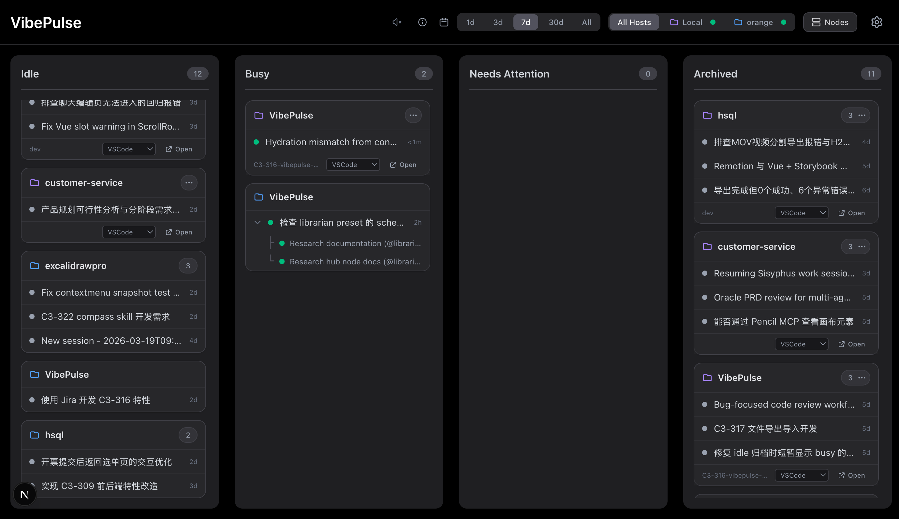

# VibePulse

[](https://www.npmjs.com/package/vibepulse)

A tiny dashboard that sits in your browser tab — tired of switching IDE tabs just to check which OpenCode sessions finished.



## What It Does

- **Kanban board** — Auto-discovers OpenCode sessions, organizes them into Idle / Busy / Review / Done
- **Remote Nodes** — Connect multiple VibePulse instances to a single hub for a unified view
- **Audio alerts** — Makes a sound when sessions complete or need attention
- **Zero setup** — No manual card creation; auto-scans ports and processes
- **Profile switcher** — Flip between OMO presets without touching config files

## Quick Start

### Hub Mode (Default)
Run VibePulse locally to monitor your local OpenCode sessions and manage remote nodes.
```bash
npx vibepulse
```
Open http://localhost:3456

### Node Mode
Run VibePulse on a remote server to expose its OpenCode sessions to a hub.
```bash
npx vibepulse --serve
```
Node mode requires an access token for security. See [Architecture](#architecture) for details.

## Features

| Feature | Description |
|---------|-------------|
| Hub & Node | Distributed architecture for monitoring multiple remote hosts |
| Real-time sync | SSE + polling for live session updates |
| Sticky states | 25s sticky window prevents status flickering |
| Offline snapshot | Shows last known state when a node is unreachable |
| IDE integration | Click to open workspace in VSCode / Antigravity |
| Config UI | Manage agent models and remote nodes through the interface |

## Architecture

VibePulse uses a Hub-and-Node architecture to aggregate OpenCode sessions across different machines.

1. **Node**: A VibePulse instance running with `--serve`. It interacts directly with the local OpenCode SDK and exposes an API.
2. **Hub**: The primary VibePulse instance (default mode). It connects to one or more Nodes to collect session data.

### Connecting a Remote Node
1. Start the remote node: `VIBEPULSE_NODE_TOKEN=your-secret npx vibepulse --serve`
2. Open your local VibePulse Hub.
3. Click the **Host Manager** icon.
4. Click **Add Remote Node**.
5. Enter the Node URL (e.g., `http://remote-server:3456`) and the Access Token.

## Development

```bash
git clone https://github.com/ChatTreeNet/VibePulse.git
cd VibePulse
npm install
npm run dev
```

## Tech Stack

- Next.js (App Router) + TypeScript
- Tailwind CSS + @dnd-kit
- TanStack Query + @opencode-ai/sdk

## License

MIT

