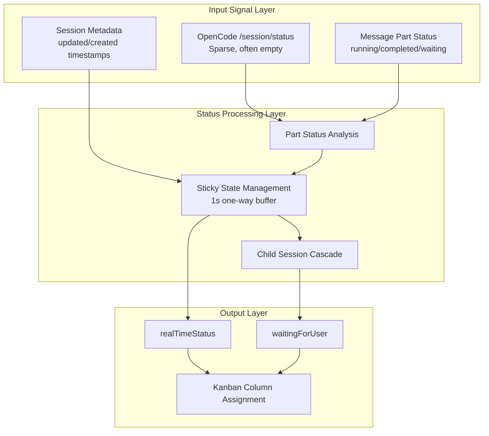
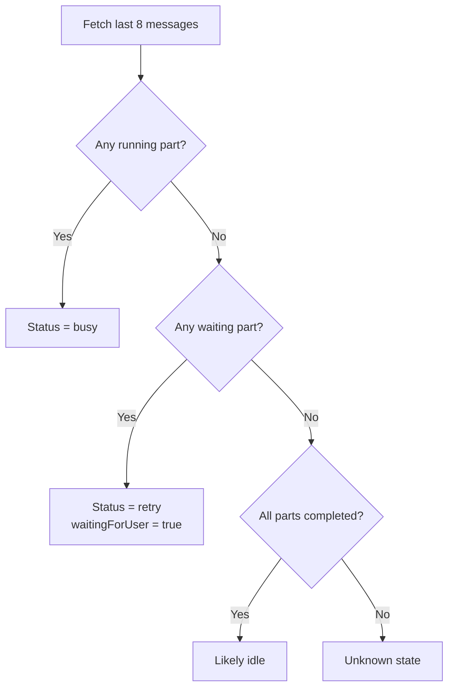
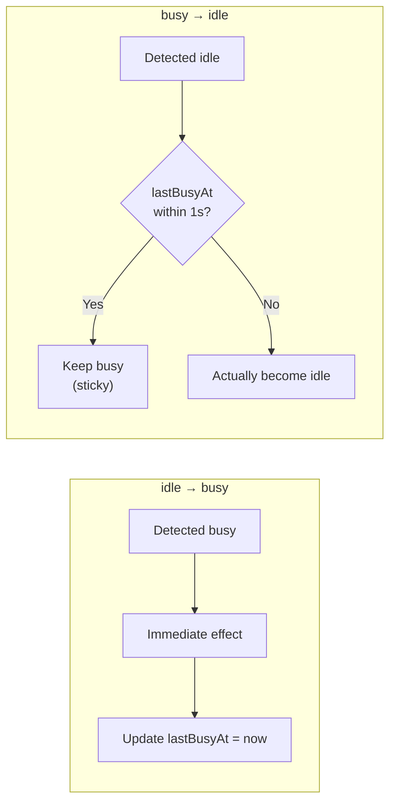
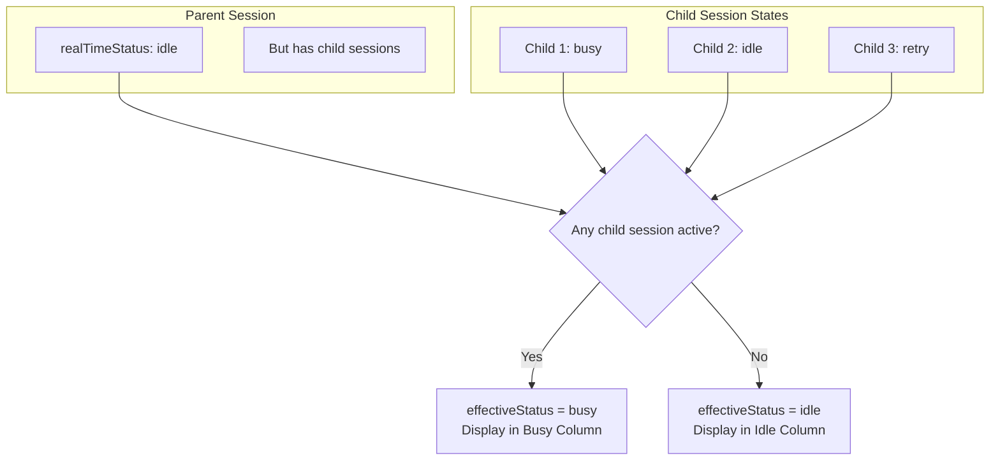
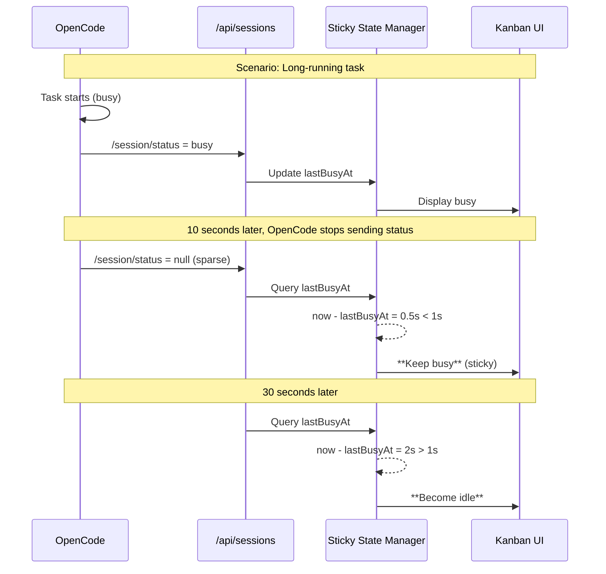
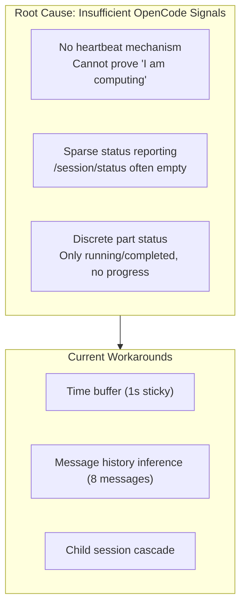
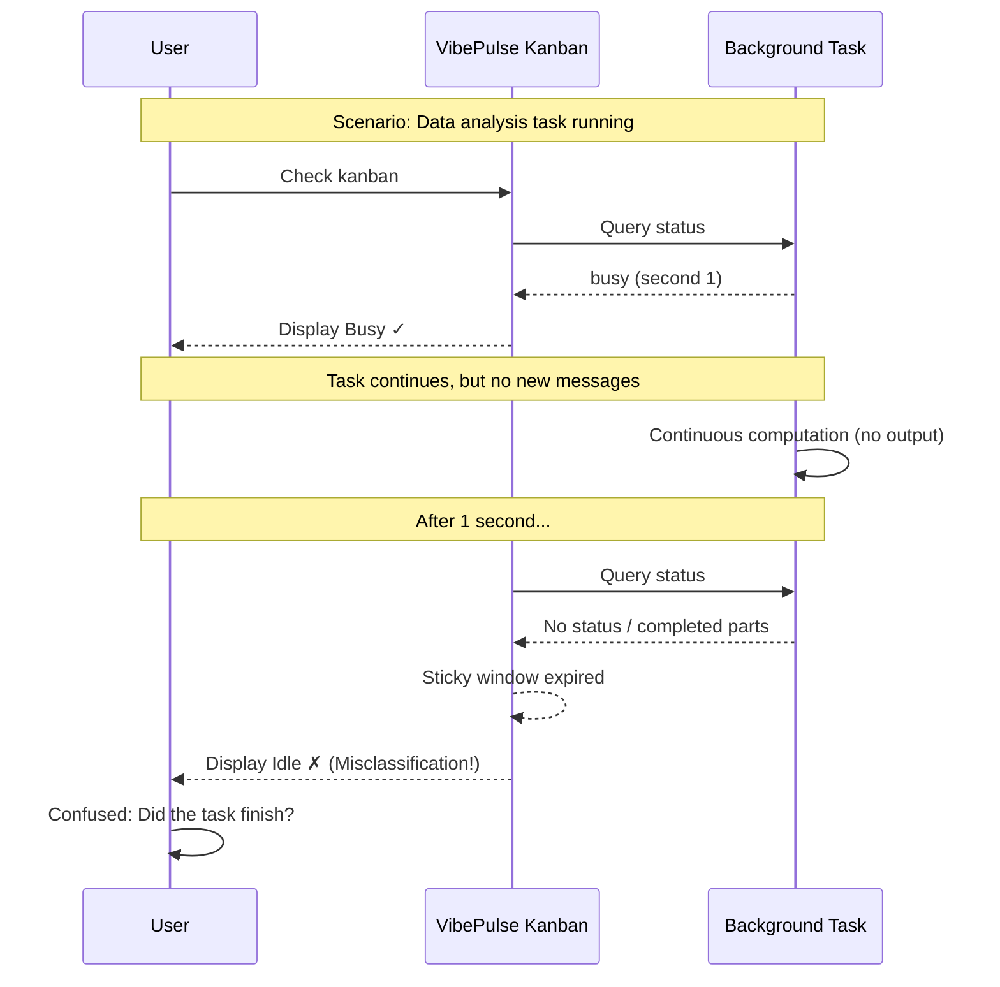
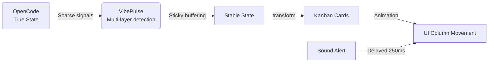

# VibePulse Session Status Detection

## Overview

VibePulse uses a multi-layer detection mechanism to determine the real-time status of OpenCode sessions (idle/busy/retry). Since OpenCode's native status reporting is sparse and delayed, the system combines multiple signals to improve status accuracy.

---

## Core Concepts

### Status Definitions

| Status | Meaning | Column |
|--------|---------|--------|
| `idle` | Idle / Completed | Idle Column |
| `busy` | Actively Running | Busy Column |
| `retry` | Waiting for User Input / Retry | Needs Attention Column |

---

## Detection Architecture

---

## Key Detection Mechanisms

### 1. Part Status Analysis

Extracts part status from recent session messages to determine activity:

**Key Limitation**: Only checks the last 8 messages. Tasks with long periods of no output are misclassified as completed.

---

### 2. One-Way Sticky State (Core Mechanism)

Prevents status jitter using a **one-way buffering strategy**:

**Design Rationale**:
- `idle → busy`: **Immediate effect** (once busy is detected, it's truly running)
- `busy → idle`: **25-second buffer** (prevents misclassification from brief state loss)

---

### 3. Child Session Cascade

Parent session status is influenced by child sessions:

---

## Complete State Transition Flow

---

## Detection Limitations (Shortcomings)

### Root Cause: Unreliable Signal Source

### Specific Shortcomings

| Shortcoming | Impact Scenario | User Experience |
|-------------|-----------------|-----------------|
| **1. Shallow message sampling** | Long computation without output | Misclassified as idle, user thinks task finished |
| **2. Fixed time window** | One-size-fits-all approach | 1s may be too short for some tasks |
| **3. No CPU/IO monitoring** | Process hang or deadlock | Continuously shows busy, user waits in vain |
| **4. Cannot detect deep subtask nesting** | Nested agent calls | Grandchild task status not trackable |
| **5. Network jitter sensitive** | Brief disconnection | May trigger unnecessary stale state |
| **6. Audio-visual out of sync** | Rapid status switching | Sound plays before/after card movement, disjointed experience |

### Misclassification Example

### Improvement Directions (Not Implemented)

| Improvement | Difficulty | Impact | Priority |
|-------------|------------|--------|----------|
| Increase message sampling depth (50 messages) | Low | Reduce misclassification | P2 |
| Process-level CPU monitoring | Medium | Detect deadlocks | P1 |
| Adaptive time window (by task type) | Medium | Precise judgment | P3 |
| MCP Progress Token integration | High | Accurate progress | P1 (requires OpenCode support) |
| Heartbeat keepalive mechanism | High | Real-time status | P2 (requires protocol change) |

---

## Key Time Parameters

| Parameter | Value | Purpose |
|-----------|-------|---------|
| `STATUS_STICKY_BUSY_WINDOW_MS` | 1 second | Buffer window for busy → idle transition |
| `CHILD_ACTIVE_WINDOW_MS` | 30 minutes | Child session activity determination window |
| `CHILD_UNKNOWN_STATE_BUSY_WINDOW_MS` | 2 minutes | Busy assumption for unknown states |
| `STALL_DETECTION_WINDOW_MS` | 30 seconds | Stall detection (if updated time is within this window) |
| `STATUS_STICKY_RETENTION_MS` | 24 hours | Sticky state memory retention time |

---

## Data Flow Summary

**Core Design Philosophy**: Due to unreliable upstream (OpenCode) signals, the system provides **good enough** stability through **time buffering** and **multi-layer inference**, rather than absolute precision.
